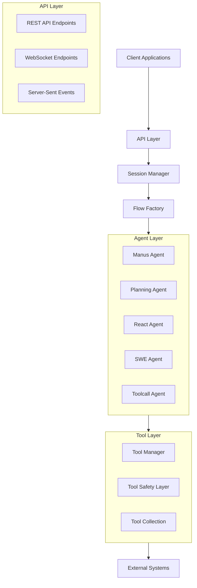

# System Patterns: ReAct Agent Backend

## System Architecture

The ReAct Agent Backend follows a layered architecture pattern with clear separation of concerns between components. The system is built on FastAPI and integrates with the existing ReAct Agent implementation.

## Key Components

### API Layer

**REST API Endpoints**
- Handles synchronous request-response interactions
- Provides authentication via HTTP Basic Auth
- Returns structured JSON responses
- Endpoints:
  - `/api/chat` - Main chat interaction endpoint
  - `/api/stream-chat` - Streaming chat endpoint

**WebSocket Endpoints**
- Manages real-time, bidirectional communication
- Supports streaming responses and logs
- Maintains persistent connections
- Endpoints:
  - `/ws/chat/{session_id}` - WebSocket chat endpoint

**Server-Sent Events (SSE)**
- Provides one-way streaming from server to client
- Streams logs, status updates, and responses
- Endpoints:
  - `/api/stream/{session_id}` - SSE streaming endpoint

### Session Management

**Session Manager**
- Creates and tracks user sessions
- Manages session timeouts and cleanup
- Isolates user interactions
- Stores message history per session
- Handles concurrent sessions

**Session**
- Contains agent instances
- Tracks message history
- Manages flow execution
- Maintains session state

### Flow System

**Flow Factory**
- Creates appropriate flow instances
- Supports different flow types
- Configures flows with agents and tools

**Base Flow**
- Defines common flow behavior
- Manages execution lifecycle
- Handles errors and retries

**Specialized Flows**
- Planning Flow - Structured planning approach
- Other specialized flows as needed

### Agent Layer

**Base Agent**
- Abstract class defining agent interface
- Manages agent state and memory
- Handles LLM interactions
- Implements step-based execution

**Specialized Agents**
- Manus Agent - General-purpose agent
- Planning Agent - Structured planning capabilities
- React Agent - Reasoning and acting pattern
- SWE Agent - Software engineering tasks
- Toolcall Agent - Tool-focused interactions

### Tool Layer

**Tool Manager**
- Configures tools based on environment
- Applies safety restrictions
- Manages tool registration

**Tool Safety Layer**
- Restricts dangerous operations
- Implements environment-specific constraints
- Provides controlled access to resources

**Tool Collection**
- Bash - Command execution
- Browser Use - Web interaction
- File Saver - File operations
- Google Search - Web search
- Python Execute - Code execution
- Terminal - Terminal interaction
- Others - Various specialized tools

## Design Patterns

### Factory Pattern
- Used in Flow Factory to create appropriate flow instances
- Encapsulates flow creation logic
- Allows for extensibility with new flow types

### Strategy Pattern
- Different agent implementations provide varying strategies
- Common interface through BaseAgent
- Allows for interchangeable agent strategies

### Observer Pattern
- Used in logging and event streaming
- Custom log handlers observe and forward logs
- Enables real-time updates to clients

### Dependency Injection
- Agents and tools are injected into flows
- Promotes loose coupling between components
- Facilitates testing and extensibility

### Context Manager Pattern
- Used for agent state transitions
- Ensures proper state handling even during exceptions
- Maintains state consistency

### Repository Pattern
- Memory acts as a repository for messages
- Provides structured access to conversation history
- Abstracts storage details

## Component Relationships

### API Layer to Session Manager
- API endpoints create or retrieve sessions
- Sessions are identified by session_id
- Session Manager maintains session lifecycle

### Session Manager to Flow Factory
- Session Manager initializes flows via Flow Factory
- Flow Factory configures flows with appropriate agents
- Flows are stored within sessions

### Flow to Agents
- Flows coordinate agent execution
- Agents implement specific capabilities
- Flows manage the overall interaction pattern

### Agents to Tools
- Agents use tools to perform actions
- Tool Manager wraps tools with safety constraints
- Tools interact with external systems

### Tools to External Systems
- Tools provide controlled access to external resources
- Safety layer restricts potentially dangerous operations
- Environment configuration determines available capabilities

## Communication Patterns

### Request-Response
- Used in REST API endpoints
- Synchronous interaction pattern
- Complete response returned at once

### Streaming
- Used in SSE and WebSocket endpoints
- Asynchronous, real-time updates
- Partial responses sent as they become available

### Event-Based
- Used for logging and status updates
- Asynchronous notifications
- One-way communication for updates

## Error Handling

### Graceful Degradation
- LLM errors handled with retry logic
- Exponential backoff for rate limits
- Fallback responses when retries exhausted

### Comprehensive Logging
- Detailed logging throughout the system
- Log streaming to clients for transparency
- Error details captured for debugging

### Exception Boundaries
- Clear exception handling at component boundaries
- State context managers for consistent state transitions
- HTTP exceptions mapped to appropriate status codes
